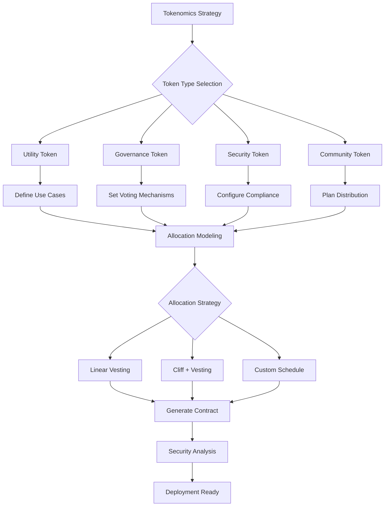
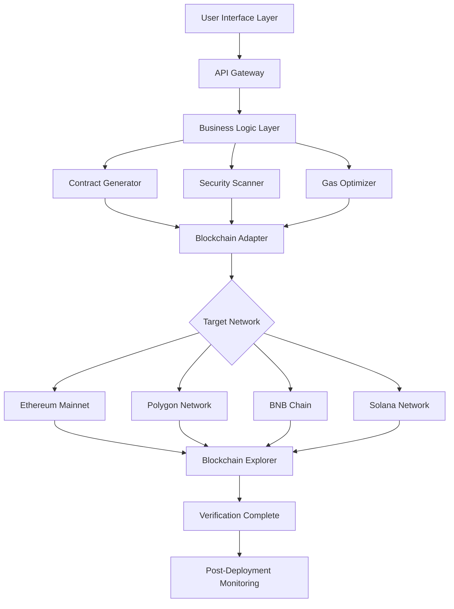

# 🚀 Advanced Cryptocurrency Creation Platform 2026

Develop and deploy sophisticated cryptocurrency tokens with our comprehensive creation platform designed for both beginners and experienced blockchain developers. Our system streamlines the token creation process while maintaining enterprise-grade security and flexibility across multiple blockchain networks.

## ⭐ Platform Overview

### Professional-Grade Development Environment
Our platform provides a complete ecosystem for token creation with industry-standard features:

- **Multi-Chain Architecture**: Support for Ethereum, Polygon, BNB Chain, Solana, and 20+ additional networks
- **Automated Contract Generation**: Production-ready smart contracts with optimized gas efficiency
- **Integrated Security Framework**: Built-in vulnerability scanning and code analysis
- **Advanced Tokenomics Tools**: Visual planning and simulation capabilities

### Technical Specifications
```yaml
platform_capabilities:
  supported_networks:
    - Ethereum (ERC-20)
    - BNB Smart Chain (BEP-20)
    - Polygon (POL)
    - Solana (SPL)
    - Avalanche (AVAX-C)
    - Arbitrum
    - Optimism
    - Base
  contract_standards:
    - Fungible Tokens (ERC20, BEP20, SPL)
    - Multi-chain Bridges
    - Custom Function Integration
    - Upgradeable Contracts
  security_features:
    - Automated Code Review
    - Gas Optimization Algorithms
    - Access Control Templates
    - Emergency Response Systems
```

## 🛠️ Core Functionality

### 1. Smart Contract Generation Engine
Our platform generates optimized, production-ready smart contracts:

```solidity
// Platform-generated ERC-20 Implementation
pragma solidity ^0.8.20;

import "@openzeppelin/contracts/token/ERC20/ERC20.sol";
import "@openzeppelin/contracts/access/Ownable.sol";
import "@openzeppelin/contracts/security/Pausable.sol";

contract AdvancedToken is ERC20, Ownable, Pausable {
    address public treasury;
    uint256 public maxTransactionAmount;
    
    constructor(
        string memory name_,
        string memory symbol_,
        uint256 initialSupply_,
        address treasury_,
        uint256 maxTx_
    ) ERC20(name_, symbol_) {
        treasury = treasury_;
        maxTransactionAmount = maxTx_;
        _mint(msg.sender, initialSupply_ * 10 ** decimals());
    }
    
    function _beforeTokenTransfer(
        address from,
        address to,
        uint256 amount
    ) internal override whenNotPaused {
        require(
            amount <= maxTransactionAmount,
            "Transfer amount exceeds maximum"
        );
        super._beforeTokenTransfer(from, to, amount);
    }
    
    function updateMaxTransaction(uint256 newMax) external onlyOwner {
        maxTransactionAmount = newMax;
    }
}
```

### 2. Tokenomics Planning System
Visualize and optimize your token distribution strategy:



## 📊 Platform Architecture

### Multi-Layer Security Framework


## 🔧 Advanced Features

### Automated Deployment Pipeline
```python
# Example deployment configuration
deployment_config = {
    "network": "polygon",
    "contract_type": "erc20_advanced",
    "parameters": {
        "name": "ProjectToken",
        "symbol": "PRJ",
        "total_supply": "1000000",
        "decimals": 18,
        "features": {
            "mintable": False,
            "burnable": True,
            "pausable": True,
            "blacklist": True,
            "tax_enabled": False,
            "max_wallet": "2%",
            "max_transaction": "1%"
        }
    },
    "security": {
        "audit_level": "standard",
        "gas_optimization": True,
        "access_control": "multi_sig"
    },
    "verification": {
        "auto_verify": True,
        "source_code": True,
        "constructor_args": True
    }
}
```

### Custom Function Integration
```solidity
// Customizable token functions
interface ICustomToken {
    function setAutomatedMarketMakerPair(address pair, bool value) external;
    function excludeFromFees(address account, bool excluded) external;
    function setTreasuryWallet(address newWallet) external;
    function setTradingEnabled(bool enabled) external;
    function setMaxWalletPercent(uint256 percent) external;
    function setMaxTransactionPercent(uint256 percent) external;
}

// Anti-bot protection implementation
contract AntiBotToken is ERC20 {
    mapping(address => bool) private _isBlacklisted;
    
    function blacklistAddress(address account, bool value) external onlyOwner {
        _isBlacklisted[account] = value;
    }
    
    function _beforeTokenTransfer(
        address from,
        address to,
        uint256 amount
    ) internal virtual override {
        require(!_isBlacklisted[from], "Sender is blacklisted");
        require(!_isBlacklisted[to], "Recipient is blacklisted");
        super._beforeTokenTransfer(from, to, amount);
    }
}
```

## 📈 Use Case Implementation

### Enterprise Token Solutions
```yaml
enterprise_configuration:
  project_type: "corporate_rewards"
  token_features:
    - role_based_access: true
    - multi_sig_required: 3_of_5
    - compliance_integration: kyc/aml
    - reporting_system: automated
    - audit_trail: immutable
  deployment_strategy:
    phase: "testnet_validation"
    environment: "staging"
    validators: ["internal", "external_audit"]
    timeline: "14_days"
  post_deployment:
    monitoring: "24/7_supervision"
    upgrades: "scheduled_maintenance"
    backup: "multi_region"
    disaster_recovery: "automated_failover"
```

### DeFi Integration Templates
```solidity
// DeFi-ready token with staking rewards
contract DeFiToken is ERC20 {
    IUniswapV2Router02 public uniswapV2Router;
    address public uniswapV2Pair;
    
    uint256 public liquidityFee;
    uint256 public treasuryFee;
    uint256 public totalFees;
    
    bool private swapping;
    
    constructor(
        address router_,
        address treasury_
    ) ERC20("DeFiToken", "DFI") {
        uniswapV2Router = IUniswapV2Router02(router_);
        uniswapV2Pair = IUniswapV2Factory(uniswapV2Router.factory())
            .createPair(address(this), uniswapV2Router.WETH());
            
        liquidityFee = 200; // 2%
        treasuryFee = 300;  // 3%
        totalFees = liquidityFee + treasuryFee;
        
        excludeFromFees(owner(), true);
        excludeFromFees(address(this), true);
    }
    
    function _transfer(
        address from,
        address to,
        uint256 amount
    ) internal override {
        // DeFi-specific transfer logic
        super._transfer(from, to, amount);
    }
}
```

## 🛡️ Security Implementation

### Comprehensive Security Architecture

```mermaid
graph LR
    A[Input Validation] --> B[Access Control]
    B --> C[Reentrancy Protection]
    C --> D[Integer Safety]
    D --> E[Gas Limit Analysis]
    
    E --> F[Automated Testing]
    F --> G[Formal Verification]
    G --> H[External Audit Integration]
    
    H --> I[Deployment Security]
    I --> J[Runtime Monitoring]
    J --> K[Incident Response]
    
    K --> L[Security Updates]
    L --> M[Continuous Improvement]
```


### Security Checklist Implementation
```solidity
// Security-enhanced base contract
contract SecureTokenBase is ERC20, Ownable, ReentrancyGuard {
    using SafeMath for uint256;
    using Address for address;
    
    // Security events
    event SecurityPause(address indexed admin, string reason);
    event SecurityResume(address indexed admin);
    event BlacklistUpdated(address indexed account, bool status);
    event LimitsUpdated(uint256 newMaxTx, uint256 newMaxWallet);
    
    // Security state
    bool public tradingEnabled = false;
    mapping(address => bool) private _isExcludedFromFees;
    mapping(address => bool) private _isBlacklisted;
    
    // Security modifiers
    modifier tradingActive() {
        require(tradingEnabled, "Trading is not active");
        _;
    }
    
    modifier notBlacklisted(address account) {
        require(!_isBlacklisted[account], "Account is blacklisted");
        _;
    }
    
    // Security functions
    function enableTrading() external onlyOwner {
        tradingEnabled = true;
        emit SecurityResume(msg.sender);
    }
    
    function updateBlacklist(
        address[] calldata accounts,
        bool isBlacklisted
    ) external onlyOwner {
        for (uint256 i = 0; accounts.length; i++) {
            _isBlacklisted[accounts[i]] = isBlacklisted;
            emit BlacklistUpdated(accounts[i], isBlacklisted);
        }
    }
}
```


## 🚀 Implementation Workflow

### Phase 1: Planning & Configuration
```yaml
planning_phase:
  requirements_gathering:
    - token_purpose: "Define primary use case"
    - target_audience: "Identify user base"
    - network_selection: "Choose optimal blockchain"
    - feature_set: "Select required functionalities"
  
  technical_specification:
    - contract_architecture: "Design contract structure"
    - tokenomics_model: "Define distribution strategy"
    - security_requirements: "Specify security measures"
    - integration_points: "Plan external connections"
```

### Phase 2: Development & Testing
```solidity
// Test-driven development approach
contract TokenTest is Test {
    AdvancedToken token;
    address owner = address(0x1);
    address user1 = address(0x2);
    address user2 = address(0x3);
    
    function setUp() public {
        vm.prank(owner);
        token = new AdvancedToken(
            "TestToken",
            "TST",
            1000000,
            owner,
            5000
        );
    }
    
    function testInitialSupply() public view {
        assertEq(token.totalSupply(), 1000000 * 10 ** 18);
        assertEq(token.balanceOf(owner), 1000000 * 10 ** 18);
    }
    
    function testTransferLimits() public {
        vm.prank(owner);
        token.transfer(user1, 5000);
        
        vm.prank(owner);
        vm.expectRevert("Transfer amount exceeds maximum");
        token.transfer(user2, 6000);
    }
}
```

### Phase 3: Deployment & Verification
```bash
# Deployment automation script
#!/bin/bash

# Load configuration
source config.env

# Validate configuration
validate_configuration() {
    echo "Validating deployment configuration..."
    # Configuration validation logic
}

# Deploy to selected network
deploy_contract() {
    case $NETWORK in
        "ethereum")
            deploy_ethereum
            ;;
        "polygon")
            deploy_polygon
            ;;
        "bsc")
            deploy_bsc
            ;;
        *)
            echo "Unsupported network"
            exit 1
            ;;
    esac
}

# Verify deployment
verify_deployment() {
    echo "Verifying contract deployment..."
    # Verification logic
}

# Main execution flow
main() {
    validate_configuration
    deploy_contract
    verify_deployment
    echo "Deployment completed successfully"
}

main "$@"
```

## 🎯 Getting Started

### Prerequisites
1. **Development Environment**: Modern web browser or development IDE
2. **Blockchain Knowledge**: Basic understanding of token concepts
3. **Network Selection**: Decided target blockchain network
4. **Use Case Definition**: Clear purpose for token creation

### Step-by-Step Process
1. **Access Platform**: Connect to development interface
2. **Select Template**: Choose appropriate token template
3. **Configure Parameters**: Set token details and features
4. **Generate Code**: Create optimized smart contracts
5. **Security Review**: Analyze and validate security measures
6. **Test Deployment**: Deploy on test network for validation
7. **Mainnet Launch**: Deploy to production network
8. **Post-Deployment**: Monitor and manage token operations

## 📚 Technical Documentation

### API Integration
```javascript
// Example API integration for token management
const TokenPlatform = require('token-platform-sdk');

const platform = new TokenPlatform({
  apiKey: process.env.API_KEY,
  network: 'polygon',
  environment: 'production'
});

// Create token instance
const tokenConfig = {
  name: 'CommunityToken',
  symbol: 'CMTY',
  totalSupply: '1000000',
  features: ['burnable', 'pausable']
};

const token = await platform.createToken(tokenConfig);

// Monitor token activities
const analytics = await platform.getTokenAnalytics(token.address);
console.log('Token Analytics:', analytics);

// Update token parameters
await platform.updateTokenSettings(token.address, {
  maxTransaction: '5000',
  tradingEnabled: true
});
```

### Development Resources
```markdown
# Available Resources

## Documentation
- **Technical API Reference**: Complete endpoint documentation
- **Integration Guides**: Step-by-step implementation instructions
- **Security Protocols**: Detailed security implementation guide
- **Best Practices**: Industry-standard development practices

## Code Libraries
- **Smart Contract Templates**: Production-ready contract code
- **Integration SDKs**: Language-specific development kits
- **Testing Frameworks**: Comprehensive testing utilities
- **Deployment Tools**: Automated deployment scripts

## Support Materials
- **Video Tutorials**: Visual learning resources
- **Case Studies**: Real-world implementation examples
- **Troubleshooting Guide**: Common issues and solutions
- **Community Examples**: User-contributed code samples
```

---

**Launch sophisticated cryptocurrency tokens with professional-grade development tools. Our platform provides comprehensive solutions for token creation, deployment, and management across multiple blockchain networks.**

*Note: Platform capabilities and features may vary based on network conditions and technical requirements. Users should conduct appropriate testing and validation before production deployment.*
